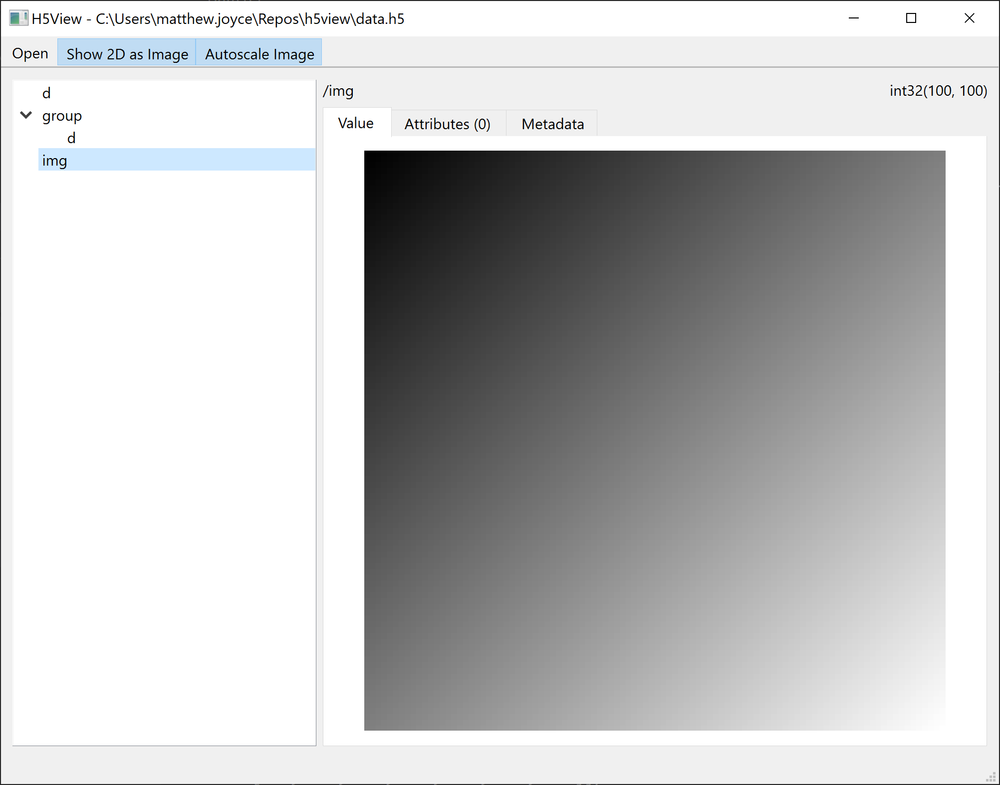
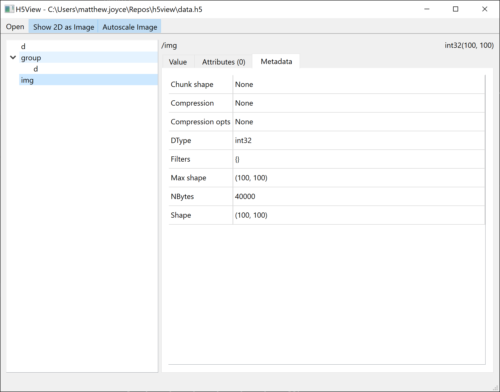

# H5View

_A small app for viewing h5 files in a simple and clean way_

 

Features:

 - Can open and view datasets of any HDF5 files h5py can read
 - Navigate heiracical groups using a simple tree view
 - Can render >=1D data as tables
 - Can render >=2D data as images
 - Sensible display of strings and other 0D data
 - Displays dataset attributes and metadata (size, datatype, compression filters, etc.)

# Development

## Run from source

 - Clone this repo.
 - Run `setup_venv.ps1` to create the virtual env (subsequent runs only need `activate_venv.ps1`).
 - Run `python -m h5view` to run the app.

## Develop

 - Clone this repo.
 - Run `setup_venv.ps1` to create the virtual env.
 - Open the workspace is VSCode.
 - Select the venv in the venv menu.
 - The ui conversion is run automatically before running the app.

## Build executable

 - Run `build.ps1`
